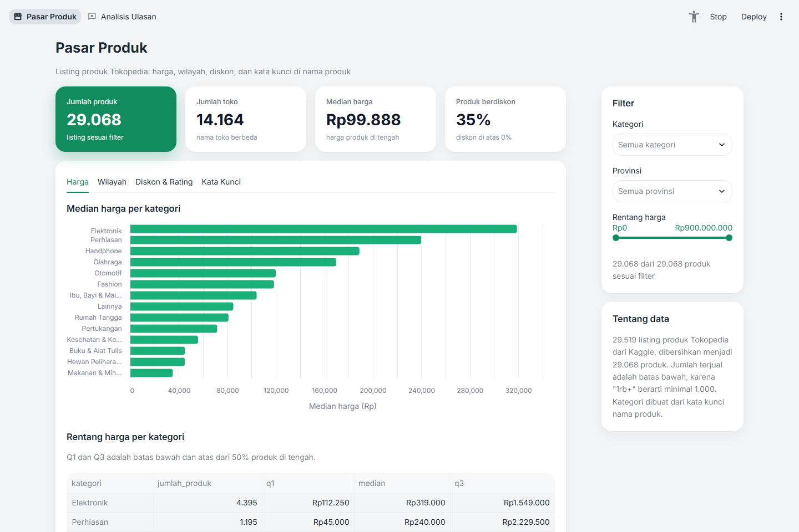
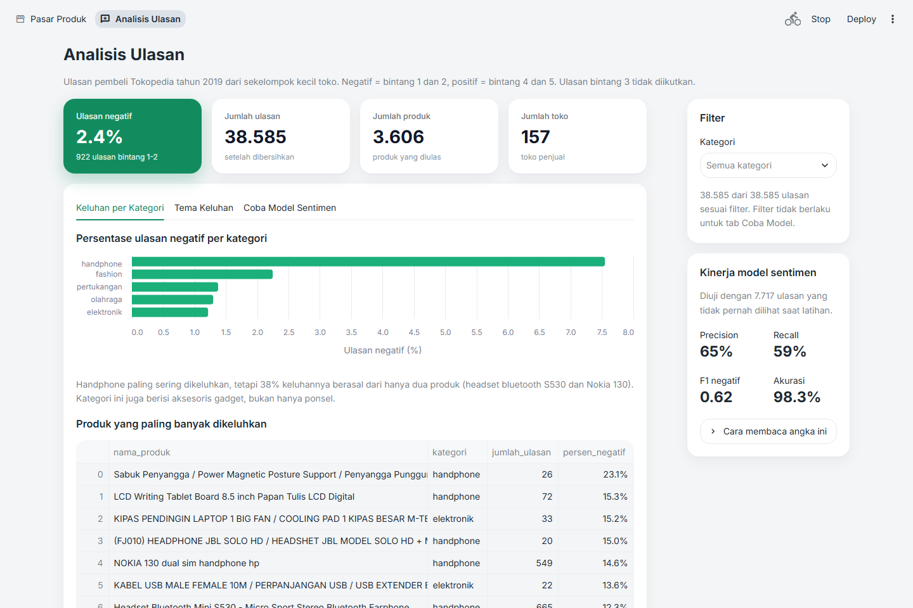

# Product Intelligence Dashboard

Riset pasar Tokopedia dari dua sisi: apa yang dijual penjual (29.519 listing produk) dan apa yang dirasakan pembeli (40.607 ulasan berbahasa Indonesia). Hasilnya berupa delapan notebook analisis, satu model sentimen, dan dashboard Streamlit dua halaman.

Dashboard: [tokopedia-market-dashboard.streamlit.app](https://tokopedia-market-dashboard.streamlit.app/)

Aplikasi di Streamlit Community Cloud akan tidur kalau tidak dikunjungi selama 12 jam. Kalau muncul tombol untuk membangunkannya, klik tombol itu dan tunggu sekitar satu menit.





## Pertanyaan yang dijawab

Dari data listing produk:

1. Bagaimana sebaran harga di setiap kategori?
2. Kota dan provinsi mana yang punya penjual paling aktif dan penjualan tertinggi?
3. Apakah diskon yang lebih besar selalu membuat produk lebih laris?
4. Apakah kata seperti "premium", "murah", atau "original" di nama produk berkaitan dengan harganya?

Dari data ulasan:

5. Bisakah ulasan negatif dikenali otomatis dari teksnya?
6. Apa yang paling sering dikeluhkan pembeli, dan apakah berbeda antarkategori?
7. Bisakah teks ulasan dipakai untuk menebak kategori produk atau bintang rating?

## Temuan utama

- Rating 5.0 lebih sering berarti produk baru punya sedikit pembeli, bukan produk terbaik. Median jumlah terjual produk ber-rating 5.0 hanya 16, sedangkan produk ber-rating 4.9 mencapai 500.
- Produk berdiskon lebih laris (median terjual 100 dibanding 26), tetapi diskon besar tidak menjamin laris. Dua pertiga produk dengan diskon di atas 50% tetap terjual di bawah 1.000.
- Kata "premium" di nama produk justru berkaitan dengan harga di bawah median kategorinya (0,82 kali), sedangkan "original" dan "official" berkaitan dengan harga 1,35 sampai 1,55 kali median kategori.
- DKI Jakarta menyumbang 46% toko dan 51% total terjual. Bersama Jawa Barat dan Banten, porsinya sekitar 90%.
- Kualitas produk adalah sumber keluhan terbesar (disebut di 28% ulasan negatif, dibanding 16% ulasan positif). Pengiriman dan pelayanan penjual justru lebih sering dipuji daripada dikeluhkan.
- Di kategori handphone, 38% keluhan berasal dari hanya dua produk.

## Model sentimen

Hanya 2,4% ulasan yang negatif, jadi model yang selalu menebak "positif" sudah mendapat akurasi 97,6% tanpa menemukan satu pun keluhan. Karena itu model dinilai dari F1 kelas negatif.

| Langkah | F1 negatif (cross-validation) |
|---|---|
| Selalu menebak positif | 0 |
| TF-IDF (1-2 gram) + Logistic Regression | 0,36 |
| Dengan class_weight balanced | 0,52 |
| Pengaturan terbaik dari GridSearchCV | 0,59 |
| Ambang keputusan disetel dengan cross-validation | 0,62 |

Data latih dan data uji dibagi per produk, jadi semua ulasan dari satu produk hanya ada di salah satu sisi. Cara ini menguji kemampuan model menilai ulasan dari produk yang belum pernah dilihatnya. Di data uji yang hanya dipakai sekali di akhir, model mendapat F1 0,57 (rentang bootstrap 95%: 0,50 sampai 0,63), precision 63%, dan recall 52%. Semua pengaturan dipilih dari cross-validation di data latih, bukan dari skor data uji.

### Kenapa skornya tidak lebih tinggi

Notebook 06 bagian 10 menguji beberapa kemungkinan penyebab:

| Kemungkinan | Hasil |
|---|---|
| Pengaturan model kurang tepat | `C` sampai 1000, fitur potongan huruf, dan gabungan fitur kata dan huruf tidak lebih baik dari model akhir |
| Data kurang | Skor naik dari 0,53 (184 ulasan negatif) ke 0,63 (738), tetapi kenaikannya terus mengecil |
| Label tidak cocok dengan isi ulasan | Diperiksa manual. Di ulasan bintang 1-2 hanya sekitar 4% yang tidak berisi keluhan. Tetapi dari 60 sampel alarm palsu, 62% ternyata keluhan berbintang 4-5 ("kainnya kurang kuat, baru dipakai sekali sobek"). Precision yang terukur 68%, sedangkan perkiraan precision sebenarnya sekitar 88% |
| Keterbatasan model berbasis kata | Dari 138 ulasan negatif yang paling yakin dilewatkan model, 77% adalah keluhan sungguhan, umumnya pendek atau memakai kata keluhan yang jarang ("Pengiriman lama", "Deker nya kekecilan") |

Jadi skor tertahan oleh dua hal: label yang keliru menekan precision yang terukur, dan keterbatasan model berbasis kata menekan recall. Langkah berikutnya yang paling menjanjikan adalah membuat data uji berlabel manual, lalu menangani negasi dan keluhan pendek, misalnya dengan model seperti IndoBERT. Hasil pemeriksaan manual ada di `Dataset/manual/cek_label_sentimen.csv`.

Dua model tambahan dicoba di notebook 08 dan hasilnya dilaporkan apa adanya. Menebak kategori dari teks ulasan hanya mencapai akurasi 41% (patokan 39%), karena kebanyakan ulasan membahas pengiriman dan penjual, bukan produknya. Model yang sama mencapai akurasi 97% kalau diberi nama produk, jadi batasnya ada di informasi dalam teks ulasan, bukan di model. Menebak bintang 1 sampai 5 tidak bisa unggul di semua ukuran sekaligus, karena ulasan bintang 4 dan 5 hampir tidak bisa dibedakan dari teksnya. Teks yang sama persis, seperti "terimakasih" (391 ulasan), diberi bintang 5 oleh 71% pembeli dan bintang 4 oleh 26% pembeli. Kedua hasil ini menjadi alasan model sentimen memakai dua kelas saja.

Sistem rekomendasi tidak dibuat, karena dataset tidak memuat data pembeli. Sebagai gantinya, notebook 07 membuat peringkat produk yang paling banyak dikeluhkan dan paling konsisten dipuji.

## Dashboard

| Halaman | Isi |
|---|---|
| Pasar Produk | Filter kategori, provinsi, dan harga. Tab harga per kategori, wilayah, diskon dan rating, serta kata kunci di nama produk |
| Analisis Ulasan | Keluhan per kategori, tema keluhan, kotak untuk mencoba model sentimen dengan ulasan sendiri, dan ringkasan kinerja model |

## Notebook

| Notebook | Isi |
|---|---|
| [01 Eksplorasi Produk](Notebooks/01_eksplorasi_produk.ipynb) | Mengenal data listing dan mencatat 11 masalah data |
| [02 Data Prep Produk](Notebooks/02_data_prep_produk.ipynb) | Mengubah "1rb+ terjual" menjadi angka, merapikan lokasi, membuat kategori |
| [03 Analisis Produk](Notebooks/03_analisis_produk.ipynb) | Harga, wilayah, diskon, rating, dan kata kunci |
| [04 Eksplorasi Ulasan](Notebooks/04_eksplorasi_ulasan.ipynb) | Ketidakseimbangan rating, bahasa informal, label noise |
| [05 Data Prep Ulasan](Notebooks/05_data_prep_ulasan.ipynb) | Pembersihan teks dan pembuatan label sentimen |
| [06 Model Sentimen](Notebooks/06_model_sentimen.ipynb) | Dari model patokan sampai penyetelan ambang, evaluasi, analisis kesalahan, dan penyebab skor mentok |
| [07 Analisis Ulasan](Notebooks/07_analisis_ulasan.ipynb) | Tema keluhan per kategori dan peringkat produk |
| [08 Model Kategori dan Rating](Notebooks/08_model_kategori_rating.ipynb) | Dua model tambahan dan alasan hasilnya lemah |

## Tantangan data

- Jumlah terjual dan jumlah ulasan tersimpan sebagai teks dengan belasan format, misalnya "1rb+ terjual", "4.95rb+", dan "1jt+". Arti tanda titik juga tidak konsisten: "1.000 ulasan" memakai titik sebagai pemisah ribuan, sedangkan "1.2rb ulasan" memakai titik sebagai desimal.
- Sekitar 34% URL produk ternyata hanya link halaman toko, sehingga URL tidak bisa dipakai untuk mendeteksi duplikat.
- Lokasi toko ditulis dalam 322 variasi, termasuk 2.834 baris yang hanya berlokasi "Indonesia". Lokasi dipetakan ke kota dan provinsi dengan tabel referensi buatan sendiri.
- Dataset produk tidak punya kolom kategori, jadi kategori dibuat dari kata kunci nama produk dengan pencocokan kata utuh. Kata yang ambigu ditangani dengan frasa khusus yang dicek lebih dulu, misalnya "mobil mobilan" (mainan, bukan otomotif) dan "rak sepatu" (rumah tangga, bukan fashion). Akurasinya diukur dengan memeriksa 200 produk acak secara manual: sekitar 90% produk yang diberi kategori tergolong dengan benar (kisaran 95%: 86% sampai 94%), naik dari 84% pada versi awal.
- Teks ulasan berisi kode HTML, huruf berulang ("baguuus"), dan singkatan. Kata "tidak" saja muncul dalam 10 ejaan berbeda.
- Kedua dataset berasal dari periode dan sumber berbeda, sehingga tidak bisa digabung per produk. Keduanya hanya disandingkan di level kategori.

## Keterbatasan

- Jumlah terjual adalah batas bawah, karena "1rb+" berarti minimal 1.000.
- Kategori berbasis kata kunci tidak sempurna. Sekitar 1 dari 10 produk yang diberi kategori masih salah golong, dan 8% produk masuk "Lainnya".
- Label sentimen berasal dari rating. Sebagian kecil ulasan bintang 1 dan 2 (sekitar 4%) isinya justru pujian, dan sebaliknya cukup banyak ulasan bintang 4 dan 5 berisi keluhan.
- Ulasan berasal dari tahun 2019 dan dari sekitar 160 toko, dengan ulasan negatif yang didominasi kategori handphone.
- Semua data adalah potret satu waktu, sehingga hasilnya menunjukkan hubungan, bukan sebab-akibat.

## Struktur proyek

```
├── app.py                    pintu masuk dashboard dan menu navigasi
├── halaman/                  dua halaman dashboard
├── src/
│   ├── produk.py             data prep listing produk
│   ├── ulasan.py             data prep ulasan
│   ├── teks.py               pembersihan teks, dipakai model dan dashboard
│   ├── tema.py               tema keluhan
│   └── tampilan.py           warna dan format angka dashboard
├── run_pipeline.py           membuat ulang data bersih dari data mentah
├── tests/                    test otomatis dengan pytest
├── Notebooks/                delapan notebook analisis
├── models/                   model sentimen dan skor evaluasinya
└── Dataset/
    ├── raw/                  data asli dan tabel referensi lokasi, tidak pernah diubah
    ├── manual/               hasil pemeriksaan manual: kategori produk dan label sentimen
    └── processed/            data bersih hasil pipeline
```

Kode data prep hanya ada di folder `src`. Notebook, pipeline, dan dashboard memakai fungsi yang sama, dan hasil `run_pipeline.py` sama persis dengan hasil notebook.

## Cara menjalankan

Siapkan environment (Python 3.12):

```
python -m venv venv
venv\Scripts\activate
pip install -r requirements-dev.txt
```

Buka dashboard:

```
streamlit run app.py
```

Buat ulang data bersih dari data mentah:

```
python run_pipeline.py
```

Jalankan test:

```
pytest
```

## Sumber data dan lisensi

| Dataset | Pembuat di Kaggle | Lisensi |
|---|---|---|
| [Indonesia E-Commerce Dataset: Tokopedia Listings](https://www.kaggle.com/datasets/pandaa12/indonesia-e-commerce-dataset-tokopedia-listings) | pandaa12 | Apache 2.0 |
| [Tokopedia Product Reviews](https://www.kaggle.com/datasets/farhan999/tokopedia-product-reviews) | farhan999 | MIT |

Kedua dataset disertakan di folder `Dataset/raw/` sesuai lisensinya masing-masing.

## Teknologi

Python, pandas, scikit-learn, matplotlib, Altair, Streamlit, pytest
